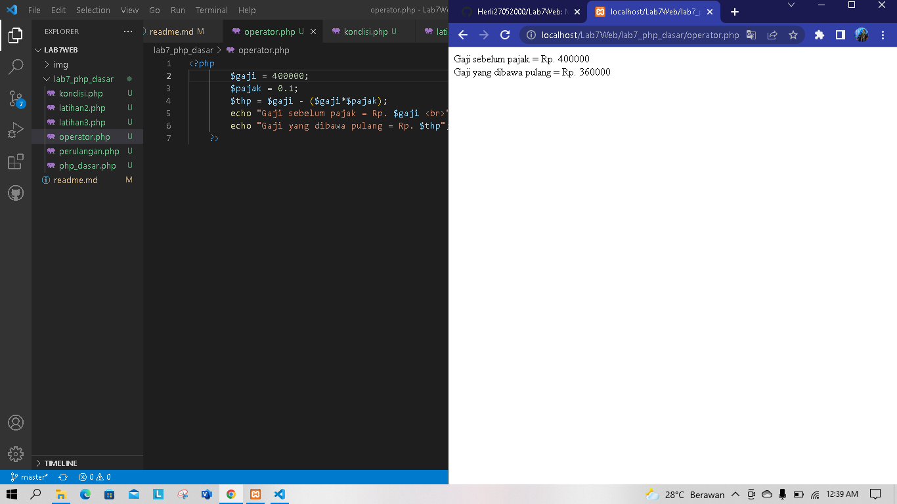
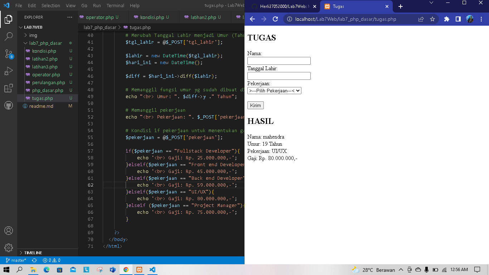

# Lab 7 Web
## Nama : Mahendra wijaya
## Nim : 312010249
## Kelas : TI.20.A2

di pertemuan ini kita akan mempelajari PHP DASAR dengan beberapa program code php nya

## Langkah - langkah pratikum sebagai berikut :

1. Instal XAMPP untuk server


instal XXAMP untuk WEB SERVER dan kemudian di ekstrak filenya dan sesuaikan dimana anda menyimpan file tersebut

2. Menjalankan Web Server


Mengaktifkan XAMPP dengan Menekan tombol START SERVER APACHE seperti contoh gambar di atas ini

3. Memulai PHP

Buatlah folder lab7_php_dasar pada root di rectory web server


di atas merupakan contoh membuat folder Lab7_php_dasar yang di mana folder itu di simpan dalam folder Lab7Web untuk repository

Kemudian akses directory pada web server dengan mengakses URL: http://localhost/Lab7Web/lab7_php_dasar/


di atas merupakan contoh dari tampilan dalam URL atau tampilan web server folder tersebut.

4. PHP DASAR

Buat file dengan nama php_dasar.php pada rectory tersebut kemudian buat lah code sebagai berikut ini


Kemudian akses URL untuk hasil nya : http://localhost/Lab7Web/lab7_php_dasar/php_dasar.php

Di atas adalah contoh hasil dari penggunaan PHP dalam file html atau embed

``` php
<!DOCTYPE html>
<html lang="en">
<head>
    <meta charset="UTF-8">
    <meta http-equiv="X-UA-Compatible" content="IE=edge">
    <meta name="viewport" content="width=device-width, initial-scale=1.0">
    <title>PHP Dasar</title>
</head>
<body>
    <h1>Belajar PHP Dasar</h1>
    <?php
        echo "Hello World";
    ?>
</body>
</html>
```

5. VARIABLE PHP

Menambahkan Variable pada pada program 


di atas adalah contoh penggunaan variable di PHP

``` php
<h2>Menggunakan Variable</h2>
    <?php
       $nim = "0411500400";
       $nama = 'Abdullah';
       echo "NIM : " . $nim . "<br>";
       echo "Nama : $nama"; 
    ?>
```

6. PREDEFINE VARIABLE $_GET

Menggunakan PREDEFINE VARIABLE


Buat File baru dalam directory lab7_php_dasar dengan nama file nya adalah latihan2.php dan buat code seperti dibawah dan untuk mengaksesnya gunakan URL: http://localhost/Lab7Web/lab7_php_dasar/latihan2.php?nama=Mahendra dan contoh tampilan nya seperti gambar diatas ini.

``` php
<!DOCTYPE html>
<html lang="en">
<head>
    <meta charset="UTF-8">
    <meta http-equiv="X-UA-Compatible" content="IE=edge">
    <meta name="viewport" content="width=device-width, initial-scale=1.0">
    <title>PHP Dasar</title>
</head>
<body>
    <!-- Variable $_GET -->
    <h2>Predefine Variable</h2>
<?php
    echo 'Selamat Datang ' . $_GET['nama'];
?> 
</body>
</html>
```

7. MEMBUAT FORM INPUT


Buat File baru dengan nama latihan3.php dalam directory folder lab7_php_dasar di atas adalah hasil atau tampilan dalam membuat form dalam php dengan variable $_POST contoh source code seperti dibawah ini


Membuat OPERATOR dalam php seperti contoh gambar hasil tampilan di atas ini

Source code

``` php
<!DOCTYPE html>
<html lang="en">
<head>
    <meta charset="UTF-8">
    <meta http-equiv="X-UA-Compatible" content="IE=edge">
    <meta name="viewport" content="width=device-width, initial-scale=1.0">
    <title>PHP Dasar</title>
</head>
<body>
    <h2>Form Input</h2>
    <form method="post">
        <label for="Nama">Nama: </label>
        <input type="text" name="nama">
        <input type="submit" value="Kirim">
    </form>
    <?php
        echo 'Selamat Datang ' . $_POST['nama'];
    ?>
</body>
</html>
```

8. OPERATOR



Membuat OPERATOR dalam php seperti contoh gambar hasil tampilan di atas ini

source code

``` php
<?php
        $gaji = 1000000;
        $pajak = 0.1;
        $thp = $gaji - ($gaji*$pajak);
        echo "Gaji sebelum pajak = Rp. $gaji <br>";
        echo "Gaji yang dibawa pulang = Rp. $thp";
    ?>
```

9. KONDISI IF


Pengundisian IF ELSE seperti gambar di atas ini hasil tampilan

source code

``` php
<?php
        $nama_hari = date("l");
        if ($nama_hari == "Sunday") {
            echo "Minggu";
        } elseif ($nama_hari == "Monday") {
            echo "Senin";
        } else {
            echo "Selasa";
        }
    ?>
```

10. KONDISI SWITCH


Contoh penggunaan pengondisian SWICTH CASE dengan Break seperti contoh hasil diatas ini

source code

``` php
<?php
        $nama_hari = date("l");
        switch ($nama_hari) {
            case "Sunday":
                 echo "Minggu";
                 break;
            case "Monday":
                echo "Senin";
                break;
             case "Tuesday":
                 echo "Selasa";
                break;
            default:
                echo "Sabtu"; 
            }
            echo "/$nama_hari";
    ?>
```

11. PERULANGAN FOR


Menggunakan PERULANGAN FOR seperti hasil gambar di atas ini

source code

``` php
<?php
        echo "Perulangan 1 sampai 10 <br />";
        for ($i=1; $i<=10; $i++) {
            echo "Perulangan ke: " . $i . '<br />';
}
        echo "Perulangan Menurun dari 10 ke 1 <br />";
        for ($i=10; $i>=1; $i--) {
            echo "Perulangan ke: " . $i . '<br />';
}
?>
```

12. PERULANGAN WHILE 


Menggunakan PERULANGAN WHILE seperti hasil gambar di atas ini

source code

``` php
<?php
    echo "Perulangan 1 sampai 10 <br />";
    $i=1;
    while ($i<=10) {
        echo "Perulangan ke: " . $i . '<br />';
        $i++;
}
?> 
```

13. PERULANGAN DOWHILE 


Menggunakan PERULANGAN DOWHILE seperti hasil gambar di atas ini.

source code

``` php
<?php
    echo "Perulangan 1 sampai 10 <br />";
    $i=1;
    do {
        echo "Perulangan ke: " . $i . '<br />';
        $i++;
    } while ($i<=10);
?>  
```

# PERTANYAAN DAN TUGAS

Buatlah program PHP sederhana dengan menggunakan form input yang menampilkan nama , tanggal lahir dan pekerjaan . Kemudian tampilkan outputnya dengan menghitung umur berdasarkan inputan tanggal lahir . Dan pilihan pekerjaan dengan gaji yang berbeda-beda sesuai pilihan pekerjaan.



Contoh dari form input menggunakan PHP disitu untuk format tanggal lahir format date nya adalah Tahun/Bulan/Tanggal dan kemudian menggunakan pengondisian if/else untuk menentukan atau memanggil pekerjaan dan gaji Seperti contoh di atas jika sudah isi data kemudian tekan tombol submit dan kirim,untuk melihat hasil nya.

source code

``` php
<!DOCTYPE html>
<html lang="en">
<head>
    <meta charset="UTF-8">
    <meta http-equiv="X-UA-Compatible" content="IE=edge">
    <meta name="viewport" content="width=device-width, initial-scale=1.0">
    <title>Tugas</title>
</head>
<body>
   <h2>TUGAS</h2>
    <form class="form" method="post" >
            <label>Nama: </label>
            <br>
            <input type="text" name="nama">
            <br>
            <label>Tanggal Lahir: </label>
            <br>
            <input type="text" name="tgl_lahir">
            <br>
            <label>Pekerjaan: </label>
            <br>
            <select name='pekerjaan'>
                <option value="-">>---Pilih Pekerjaan---<</option>
                <option value='Fullstack Developer'>Fullstack Developer</option>
                <option value='Front end Developer'>Front end Developer</option>
                <option value='Back end Developer'>Back end Develope</option>
                <option value='UI/UX'>UI/UX</option>
                <option value="Project Manager">Project Manager</option>
            </select>
            <br>
            <br>
            <button type="submit">Kirim</button>
    </form>
    <h2>HASIL</h2>
  </body>
</html>
```

``` php

<?php
        # Memanggil Nama
        echo 'Nama: ' . $_POST['nama'];

        # Merubah Tanggal Lahir menjadi Umur (Tahun)
        $tgl_lahir = @$_POST['tgl_lahir'];

        $lahir = new DateTime($tgl_lahir);
        $hari_ini = new DateTime();

        $diff = $hari_ini->diff($lahir);

        # Memanggil fungsi umur yg sudah dibuat diatas
        echo "<br> Umur: ". $diff->y ." Tahun";

        # Memanggil pekerjaan
        echo "<br> Pekerjaan: ". $_POST['pekerjaan'];

        # Kondisi if pekerjaan untuk menentukan gaji
        $pekerjaan = @$_POST['pekerjaan'];

        if($pekerjaan == "Fullstack Developer"){
            echo '<br> Gaji: Rp. 25.000.000,-';
        }elseif($pekerjaan == "Front end Developer"){
            echo '<br> Gaji: Rp. 45.000.000,-';
        }elseif($pekerjaan == "Back end Developer"){
            echo '<br> Gaji: Rp. 59.000.000,-';
        }elseif($pekerjaan == "UI/UX"){
            echo '<br> Gaji: Rp. 80.000.000,-';
        }elseif ($pekerjaan == "Project Manager"){
            echo '<br> Gaji: Rp. 75.000.000,-';
        }

    ?>
```

Tambahkan code PHP di atas dalam HTML

source code full nya

``` php
<!DOCTYPE html>
<html lang="en">
<head>
    <meta charset="UTF-8">
    <meta http-equiv="X-UA-Compatible" content="IE=edge">
    <meta name="viewport" content="width=device-width, initial-scale=1.0">
    <title>Tugas</title>
</head>
<body>
   <h2>TUGAS</h2>
    <form class="form" method="post" >
            <label>Nama: </label>
            <br>
            <input type="text" name="nama">
            <br>
            <label>Tanggal Lahir: </label>
            <br>
            <input type="text" name="tgl_lahir">
            <br>
            <label>Pekerjaan: </label>
            <br>
            <select name='pekerjaan'>
                <option value="-">>---Pilih Pekerjaan---<</option>
                <option value='Fullstack Developer'>Fullstack Developer</option>
                <option value='Front end Developer'>Front end Developer</option>
                <option value='Back end Developer'>Back end Develope</option>
                <option value='UI/UX'>UI/UX</option>
                <option value="Project Manager">Project Manager</option>
            </select>
            <br>
            <br>
            <button type="submit">Kirim</button>
    </form>
    <h2>HASIL</h2>

    <?php
        # Memanggil Nama
        echo 'Nama: ' . $_POST['nama'];

        # Merubah Tanggal Lahir menjadi Umur (Tahun)
        $tgl_lahir = @$_POST['tgl_lahir'];

        $lahir = new DateTime($tgl_lahir);
        $hari_ini = new DateTime();

        $diff = $hari_ini->diff($lahir);

        # Memanggil fungsi umur yg sudah dibuat diatas
        echo "<br> Umur: ". $diff->y ." Tahun";

        # Memanggil pekerjaan
        echo "<br> Pekerjaan: ". $_POST['pekerjaan'];

        # Kondisi if pekerjaan untuk menentukan gaji
        $pekerjaan = @$_POST['pekerjaan'];

        if($pekerjaan == "Fullstack Developer"){
            echo '<br> Gaji: Rp. 30.000.000,-';
        }elseif($pekerjaan == "Front end Developer"){
            echo '<br> Gaji: Rp. 12.000.000,-';
        }elseif($pekerjaan == "Back end Developer"){
            echo '<br> Gaji: Rp. 15.000.000,-';
        }elseif($pekerjaan == "UI/UX"){
            echo '<br> Gaji: Rp. 55.000.000,-';
        }elseif ($pekerjaan == "Project Manager"){
            echo '<br> Gaji: Rp. 60.000.000,-';
        }

    ?>
  </body>
</html>
```